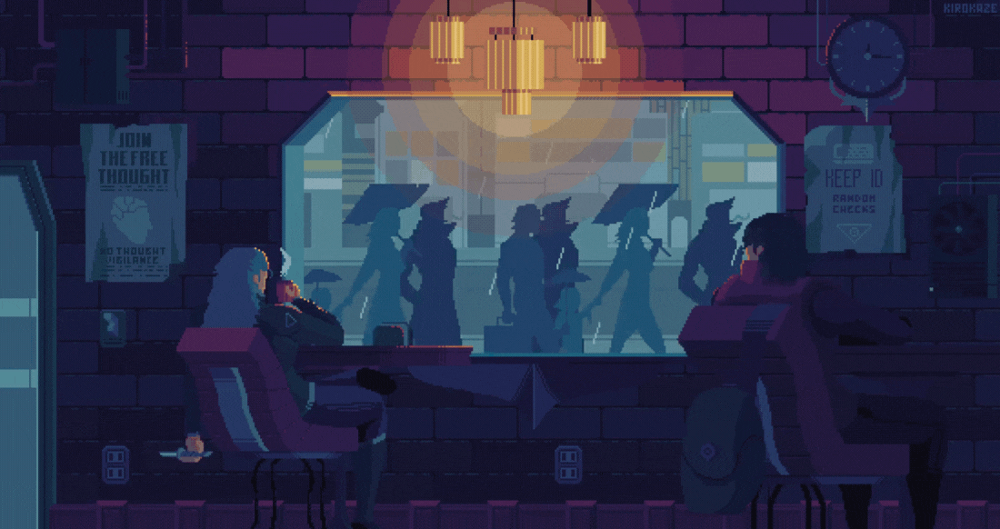

Background GIF from [Pinterest](https://www.pinterest.com/pin/5277724550564022/).

 &nbsp;
 &nbsp;

- 🌱 I’m passionate about **System Design**, **C++**, and **Machine Learning**.
- 🏆 I'm striving to increase my [GitHub stats rating](#🏆-my-stats).
- ⚡ Fun fact: I love typing challenges, exploring new tech, and playing chess.

## 💡 A Quote:

## 💻 My Tech Stack:

## 📖 Read My Blogs:

    &nbsp;&nbsp;
    &nbsp;&nbsp;

## 🏆 My Stats:

 
    :/

## 🎮 When I'm AFK:

 &nbsp;
 &nbsp;
 &nbsp;

